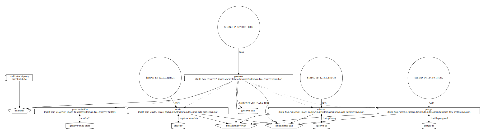

# Tailormap Data

Provides a stack of databases (PostGIS, Oracle XE, MS SQL Server Developer and a Solr image) with preloaded data and a
preconfigured GeoServer.
This compose stack is meant for demonstration and unit/integration testing purposes; it is not a production stack.
Notably this
stack exposes the various database TCP ports on the host (by default binds to 127.0.0.1) and uses plain text passwords
in the GeoServer datastores.

After starting the GeoServer admin password will be changed to one given using the `GEOSERVER_ADMIN_PASSWORD`
environment variable. This incurs a config reload as well.

## Building the Solr image

The Solr image is build using `docker buildx` from the `solr/Dockerfile` in a multi-platform build. Check the workflow
file `.github/workflows/build-publish.yml` for details.
This image is used to provide a Solr instance for Tailormap and is available using eg. `docker pull ghcr.io/tailormap/solr:snapshot`.

## Building and running the stack

**NOTE** You need to have git-lfs installed to get the dump files, if the dump files are missing from
eg. `oracle/dumpdir/` or `tailormap-data/mssql/docker-entrypoint-initdb.d`

### Build

`GEOSERVER_DATA_DIR=/opt/geoserver-data docker compose -f ./docker-compose.yml build --pull --parallel --compress --no-cache`
will build but not run the stack

### Deploy

**NOTE** For integration testing `tailormap-api` do not use this stack but use the `docker-compose.yml` file in
`build/ci/` of the Tailormap API project. Use the above command to build the images locally though.



For Bash:

```bash
# create external networks
docker network create tailormap-viewer
docker network create traefik
# bind to all ip addresses of the host (insecure!)
export BIND_IP=0.0.0.0
export GEOSERVER_ADMIN_PASSWORD=geoserver123
export GEODATA_PASSWORD=07d8313e-75b1-46
export GEOSERVER_DATA_DIR=/opt/geoserver-data

docker compose -f ./docker-compose.yml up -d --build
```

will (re)build what is needed and start the containers in this stack.

For Powershell:

```ps1
docker network create tailormap-viewer
docker network create traefik

# bind to all ip addresses of the host (insecure!)
$env:BIND_IP="0.0.0.0"
$env:GEOSERVER_DATA_DIR="/opt/geoserver-data"
$env:GEOSERVER_ADMIN_PASSWORD="geoserver123"
$env:GEODATA_PASSWORD="07d8313e-75b1-46"

docker compose -f ./docker-compose.yml up -d --build

```

_Note that on Windows you probably need to open TCP firewall ports for GeoServer (8080), Oracle (1521), 
PostgreSQL (5432) and SQL Server (1433).

To rebuild and deploy a single service (eg. sqlserver)
`docker compose -f ./docker-compose.yml up -d --no-deps --build --force-recreate sqlserver`

### Cleanup

Cleanup all built images and volumes (including persistent data!) using
`docker compose -f ./docker-compose.yml down --rmi all -v`

## Testdata in these images

### BGT

A small area of the Dutch BGT (Basisregistratie Grootschalige Topografie) is included, the area is:
`SRID=28992;Polygon ((130011 458031, 130011 459995, 132703 459995, 132703 458031, 130011 458031))`
A small area of OpenStreetMap is loaded into PostGIS only (bounding box: `4.9715,52.0907,5.1237,52.1558`).
See below on how this data was prepared for each database to be loaded at container/volume instantiation.

## PostGIS

You can connect to the PostGIS `geodata` database in the `tailormap-data` network or on the `host` network on port 5432
using the `geodata` user.

### datasets

#### BGT

The BGT dataset was loaded using the command:

```bash
docker run -it --rm --network=host ghcr.io/b3partners/brmo-bgt-loader:snapshot download initial \
                    --geo-filter="Polygon ((130011 458031, 130011 459995, 132703 459995, 132703 458031, 130011 458031))" \
                    --connection="jdbc:postgresql://localhost:5432/geodata?sslmode=disable&reWriteBatchedInserts=true" \
                    --user=geodata --password=07d8313e-75b1-45

```

Note that the postgis image will load any `*.sql` and `*.sql.gz` into the default (postgres) database, we add `.dump`

```bash
docker compose exec -u postgres postgis pg_dump --no-owner --compress=9 -xE UTF-8 \
      --exclude-table=spatial_ref_sys,geography_columns,geometry_columns,brmo_metadata \
      -S postgres --disable-triggers --dbname=geodata -f /tmp/dump.sql.gz
# Docker Compose 2 docker compose cp postgis:/tmp/dump.sql.gz postgis/initdb/geodata.sql.gz
docker cp postgis:/tmp/dump.sql.gz postgis/docker-entrypoint-initdb.d/2-geodata.sql.gz.dump
```

#### OSM

**Note:** OpenStreetMap-data are provided under the Open Data Commons Open Database (ODbL) licence.

The OSM dataset is derived from Geofabrik using the commands:

```bash
wget https://download.geofabrik.de/europe/netherlands/utrecht-latest.osm.pbf -o /tmp/utrecht-latest.osm.pbf
osmium extract -b 4.9715,52.0907,5.1237,52.1558 /tmp/utrecht-latest.osm.pbf -o postgis/docker-entrypoint-initdb.d/2-geodata.osm.pbf --overwrite

```

## Oracle

You can connect to the Oracle `FREEPDB1` service in the `tailormap-data` network or on the `host`
network on port 1521 using the `geodata` user.

### datasets

#### BGT

The BGT dataset was loaded using the command:

```bash
docker run -it --rm --network=host ghcr.io/b3partners/brmo-bgt-loader:snapshot download initial \
                    --geo-filter="Polygon ((130011 458031, 130011 459995, 132703 459995, 132703 458031, 130011 458031))" \
                    --connection="jdbc:oracle:thin:@localhost:1521/FREEPDB1" \
                    --user=geodata --password="07d8313e-75b1-45"
```

and exported using datapump:

```bash
docker exec oracle rm -f /tmp/dumpdir/*
docker compose exec -u oracle oracle expdp geodata/07d8313e-75b1-45@localhost:1521/FREEPDB1 \
                    DUMPFILE=dumpdir:geodata.dump LOGFILE=dumpdir:geodata.log SCHEMAS=geodata
docker cp oracle:/tmp/dumpdir/ oracle/
```

Note that the `dumpdir` is created during database init.

## SQL Server

You can connect to the SQL Server `geodata` database in the `tailormap-data` network or on the `host` network
on port 1433 using the `geodata` user.

### datasets

#### BGT

The BGT dataset was loaded using the command:

```shell
docker run -it --rm --network=host ghcr.io/b3partners/brmo-bgt-loader:snapshot download initial \
                    --geo-filter="Polygon ((130011 458031, 130011 459995, 132703 459995, 132703 458031, 130011 458031))" \
                    --connection="jdbc:sqlserver://localhost:1433;databaseName=geodata;encrypt=false" \
                    --user=geodata --password="07d8313e-75b1-45"
```

After loading the BGT a `geometry_columns` table was added using `geometry_columns.sql` and then exported using backup.

```shell
docker exec sqlserver rm -f /tmp/geodata.bak
docker compose exec -u mssql sqlserver /opt/mssql-tools18/bin/sqlcmd -S localhost \
              -Q "BACKUP DATABASE geodata TO DISK='/tmp/geodata.bak'" -U geodata -P "07d8313e-75b1-45"
docker cp sqlserver:/tmp/geodata.bak mssql/docker-entrypoint-initdb.d/geodata.backup.dump
```

## GeoServer

Geoserver comes preconfigured with three `geodata` datastores from the above databases (postgis/oracle/sqlserver) and
one
`osm` datastore from postgis only. For each database there is a workspace (postgis/oracle/sqlserver) that has a few
layers published.
The global WMS config is limited to EPSG:28992, EPSG:4326 and EPSG:3857 and creating tiled layers by default is off.
WCS is turned off.

You can rebuild and restart the geoserver container using
`GEOSERVER_DATA_DIR=/opt/geoserver-data GEOSERVER_ADMIN_PASSWORD=geoserver123 GEOSERVER_CSRF_WHITELIST=localhost docker compose up -dV --no-deps --build --force-recreate geoserver`

If you want to make changes to the image start the stack and then make those changes, copy the datadir from the
container to a local directory using `docker cp geoserver:/opt/geoserver-data geoserver/maven/src/main/webapp/`.
Then copy/update the files in the data directory after which you can create a pull request with the changes.

### environment

- **GEOSERVER_DATA_DIR** the location of the Geoserver data directory, normally `/opt/geoserver-data`
- **GEOSERVER_CSRF_WHITELIST** A list of allowed domains for the CSRF tokens,
  see: https://docs.geoserver.org/stable/en/user/security/webadmin/csrf.html
- **GEOSERVER_CSRF_DISABLED** enable or disable CSRF tokens,
  see: https://docs.geoserver.org/stable/en/user/security/webadmin/csrf.html

## Usage

You can add the GeoServer services in Tailormap using the url
`http://geoserver:8080/geoserver/ows?service=WMS&request=GetCapabilities` if you are using a local deployment or
`https://snapshot.tailormap.nl/geoserver/ows?service=WMS&request=GetCapabilities` when using the deployment
on the h03.b3p.nl server

Note that you may need to update the proxy url in the GeoServer settings and the `cookie-config` in the `web.xml` file.

You can add the attribute sources in Tailormap admin using `oracle`, `postgis` or `sqlserver` as the hostname
and using the `geodata` user.

For Oracle you must use database `/FREEPDB1` and schema `GEODATA`,
for PostGIS you must use database `geodata` with schemas `public` and/or `osm`,
for SQL Server you must use database `geodata;encrypt=false` with schema `dbo` because the SQL Server JDBC driver
defaults to using TLS with and SQL Server does that with a self-signed certificate by default. 
